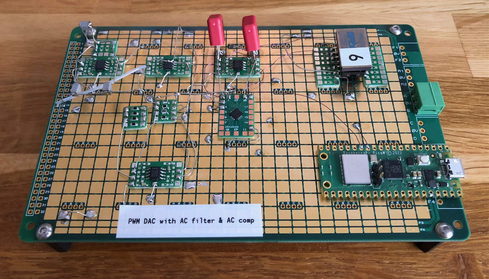
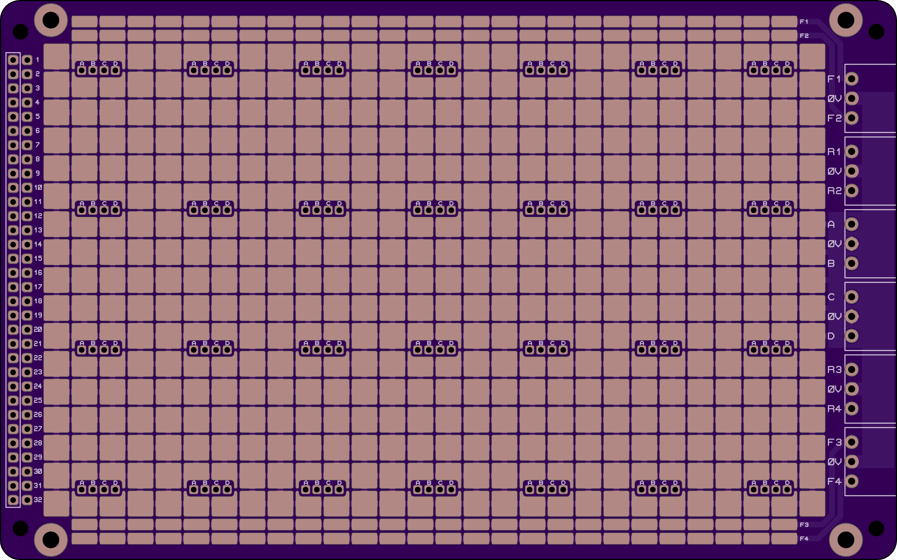
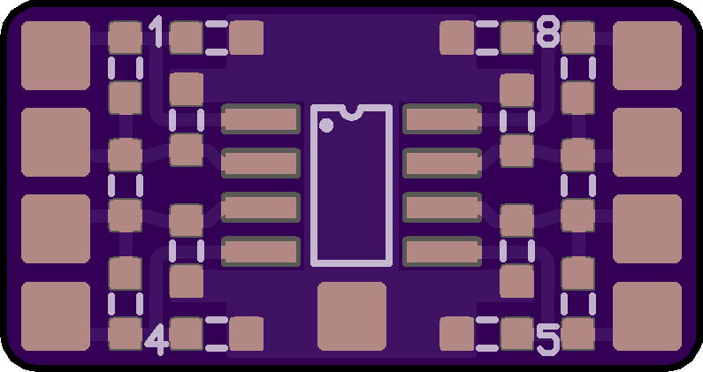
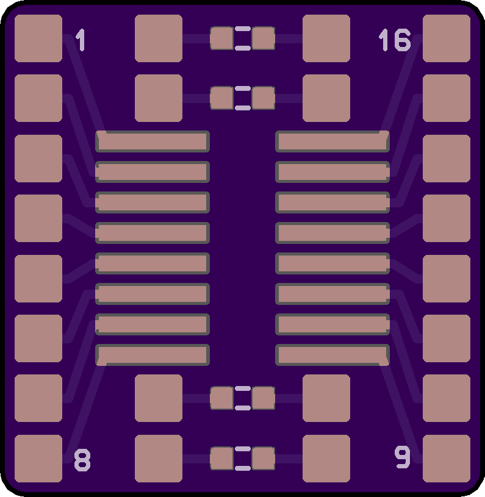
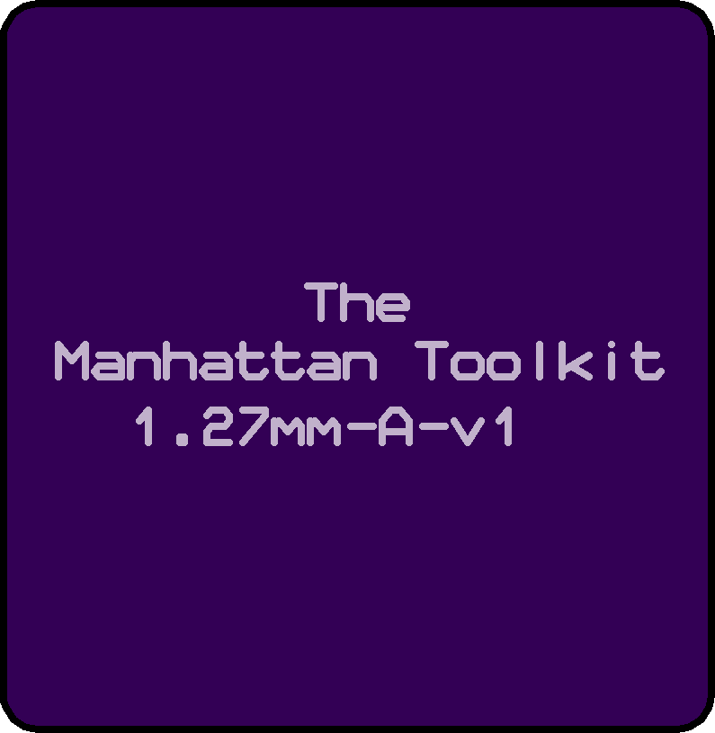
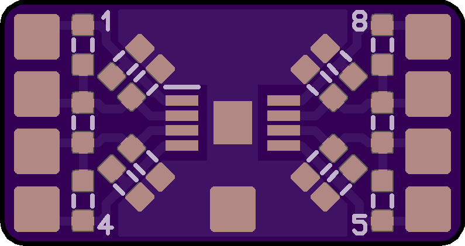
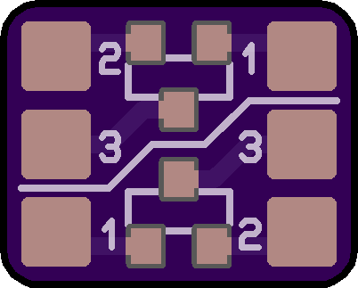
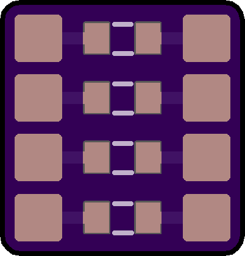
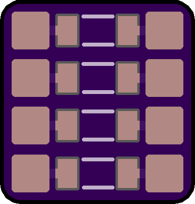
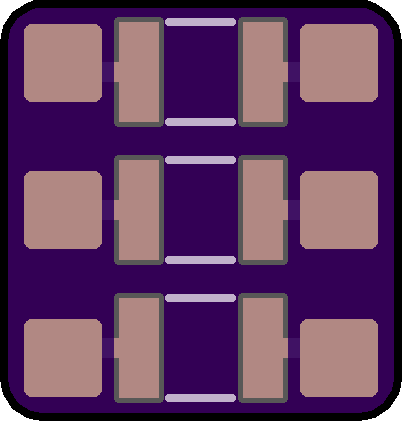

# The Manhattan Toolkit

Electronic circuit prototyping system for reliable rapid prototyping.

Use double sided tape to stick down SMT breakout boards onto a base board.

Use hookup wire or bare tinned copper wire to make connections.

Mount through-hole components directly, sometimes using islands as a convenient landing pad.

Use pluggable terminal blocks to make external connections.

Label your boards to ensure you don't forget what they are in future!

## Accessories

[3M 9084 9mm wide double sided tape](https://ie.rs-online.com/web/p/double-sided-tapes/5034632)  
[0.5mm diameter tinned copper wire](https://cpc.farnell.com/unbranded/tcw25-250g/tinned-copper-wire-25swg/dp/CB00044)  
[0.71mm teflon tubing](https://cpc.farnell.com/pro-elec/pelb0430/ptfe-teflon-tubing-0-71mm-clear/dp/CB22101)  
[0.19mm polyurethane coated pencil wire](https://cpc.farnell.com/pro-power/rrw-v-105-pk-4/wire-0-19mm-purple-pk-4/dp/PC01666)  
[18mm M3 female hex threaded black nylon standoff](https://www.amazon.co.uk/gp/product/B07FS9B4Q1)  
[3W 3.5mm pluggable terminal block socket](https://cpc.farnell.com/camdenboss/ctbp93hd-3/term-block-header-8a-3p-3-5mm/dp/CN20920)  
[3W 3.5mm pluggable terminal block](https://cpc.farnell.com/camdenboss/ctbp92hd-3/terminal-block-pluggable-8a-3p/dp/CN20880)

## Example prototypes

## Base-A-v1

4 layer base board in 160x100mm eurocard form factor. The grid is connected to 0V. There are 4 possible power planes which have corresponding connectors; A/B/C/D. There are 8 signal rails which have corresponding connectors; F1/F2/F3/F4/R1/R2/R3/R4 (4 front/4 rear, split into 2 top/2 bottom) typically used for input/output signals. The M3 holes are for generic mounting. The unplated holes are for Schroff front panel brackets to allow prototypes to be easy mounted in a eurocard chassis with an attractive front panel. The narrow empty region at top/bottom are keepout areas to allow the card to slide on chassis rails.

Connectors along the right edge are 3.5mm pitch pluggable terminal blocks. Socket part number: CTBP93HD/3. Plug part number: CTBP92HD/3. The footprint will be compatible with many manufacturers.

The parts for mounting to a eurocard front panel are [shown here.](images/Schroff-parts.png)

## SOIC8-A-v1

 

## 1.27mm-A-v1

 

## MSOP8-A-v1

 

## Islands4x4-A-v1

 

## SOT23-A-v1

 

## 0603-A-v1

 

## 0805-A-v1

 

## 1206-A-v1

 

## 1210-A-v1

 

## Sizes

Base-A-v1 grid unit = 5mm  
Breakout PCB corner radius = 1mm  
Breakout pad = 2mm square with 0.25mm corner radius  
Breakout pad centre to edge distance = 1.5mm (hence 0.5mm clearance between edge of pad and edge of PCB)

(Breakout) - (Width x Height)  
SOIC8-A-v1 - 20mm x 10.5mm  
1.27mm-A-v1 - 20mm x 20.5mm  
MSOP8-A-v1 - 20mm x 10.5mm  
Islands4x4-A-v1 - 11.5mm x 11.5mm  
SOT23-A-v1 - 10mm x 8mm  
0603-A-v1 - 10mm x 10.5mm  
0805-A-v1 - 10mm x 10.5mm  
1206-A-v1 - 10mm x 10.5mm  
1210-A-v1 - 10mm x 10.5mm  
